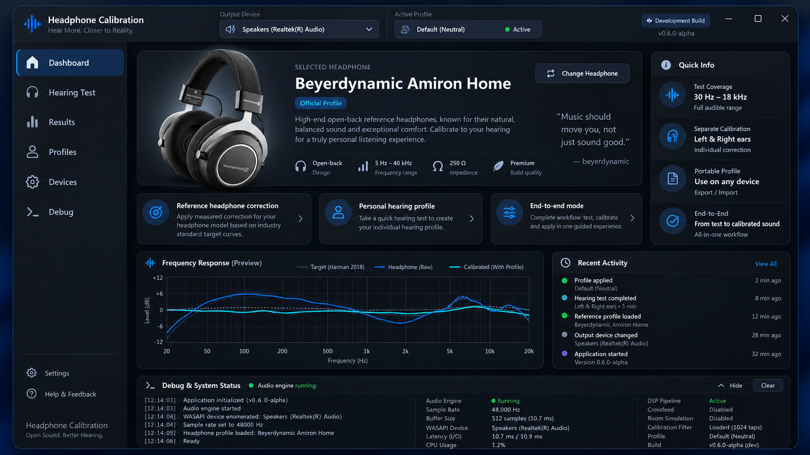

# AudioTune

AudioTune is a local-first Windows application for personal, device-bound headphone calibration. It measures left/right hearing thresholds, preserves the raw measurement history, derives an adjustable correction, supports level-matched music A/B testing, and can apply persistent per-device DSP through Equalizer APO.

> **Alpha software:** AudioTune is not a medical audiometer. Its measurements are relative digital levels in dBFS and must not be interpreted as dB HL, a diagnosis, or a clinical hearing-loss assessment.



[Deutsche README](README.de.md) · [Documentation index](Documentation/INDEX.md) · [Known issues](Documentation/KNOWN_ISSUES.md) · [Roadmap](Documentation/ROADMAP.md)

## Highlights

- 30 Hz–18 kHz adaptive hearing test for each ear with autosave and point retesting
- separate, non-destructive Hearing Profiles and Correction Presets
- correction model v5 with Fine Tune, stereo-image preservation, and centering
- one fitted parametric-EQ definition for preview and Equalizer APO
- persistent, per-device Windows DSP with level-matched bypass
- fully local profile storage under `%LOCALAPPDATA%\AudioTune`
- offline Windows setup that carries the required .NET 10 Desktop Runtime and installs it only when missing

## Install

Download `AudioTuneSetup-0.4.16-alpha.exe` from the repository release and run it on 64-bit Windows. The setup contains the application and the verified Microsoft .NET 10 Desktop Runtime prerequisite. Equalizer APO is optional and is offered from the Devices page when system-wide DSP is requested.

AudioTune does not silently change Windows master volume. Persistent DSP must be explicitly configured for the intended playback endpoint.

## Development status

Current baseline: **v0.4.16-alpha (2026-09-18)**. The source builds cleanly on Windows with .NET SDK 10.0.401 (0 warnings, 0 errors). Before changing code, read [`AGENTS.md`](AGENTS.md) and [`Documentation/INDEX.md`](Documentation/INDEX.md).


## v0.4.16-alpha

### Profiles UI polish

- Correction Presets now render by preset name with a visual preset icon instead of the CLR type name.
- Correction preset summary metrics now include compact icons.
- Quick Actions now use the icon + label layout from the approved mockup.
- The selected active hearing profile now shows a dedicated green `Active Profile` status badge instead of a disabled grey button.


- Profiles page redesigned into a compact profile manager matching the new Devices design language.
- Saved hearing profiles use searchable cards with clear active/archive status.
- Selected profile, correction preset, quick actions and measurement summary are separated into focused panels.
- Correction intensity remains only on Devices and now ranges from 0% to 200% (100% is the unchanged default).
- Correction/DSP graph ranges expand to support up to 200% intensity.


### Auto-apply reliability fix

- Fine Tune ON/OFF, correction intensity and stereo-centering updates now call the exact same persistent APO write path as the manual **Apply / Update DSP** action whenever **Auto-apply DSP changes** is enabled.
- A stale correction signature is no longer treated as a reason to skip auto-apply; that stale signature is the state auto-apply is intended to replace.
- An explicit level-matched bypass is still preserved and will not be silently re-enabled.


- Fixed DSP auto-apply after Fine Tune/intensity changes: an existing persistent DSP is now rewritten immediately even though its previous correction signature is intentionally stale.
- Fine Tune ON/OFF passes the exact edited preset into auto-apply instead of resolving it again.
- Apply / Update DSP no longer shows the large confirmation/details dialog; normal application is immediate. Blocking errors and exceptional signal-path warnings remain.


### Devices crash fix
- Fixed a startup-order crash when opening the redesigned **Devices** page with Auto-apply enabled. The correction-intensity slider could raise `ValueChanged` while WPF was still running `InitializeComponent()`, before the auto-apply timer existed.
- Devices UI events now ignore XAML initialization and the timer is created before the visual tree is loaded.
- Devices-page initialization is guarded so a future registry/status/UI error reports a message and log entry instead of terminating the entire AudioTune process.

### Devices redesign / DSP auto-apply
- Rebuilt **Devices** as a compact DSP control center based on the approved mockup: DSP target selector, status chips, visual signal chain, four primary DSP actions, concise DSP summary and a collapsed playback-device section.
- Removed the large explanatory/warning text blocks from the normal Devices view; explanations now live behind small info buttons.
- The detected playback-device section is collapsed by default and is now functional: any detected endpoint can be assigned directly as the AudioTune test output or DSP target.
- Added **Auto-apply DSP changes** (enabled by default for new settings). Fine Tune ON/OFF and correction-intensity changes automatically rewrite an already-active persistent DSP for the same profile/device.
- Auto-apply never silently creates new DSP routing, replaces a different profile, or turns an intentional level-matched bypass back on.
- Fine Tune ON/OFF reports whether the Windows DSP was updated immediately or whether an update is pending.
- Stereo Centering save also participates in the same safe auto-apply path.

### Fine Tune → APO bugfix / diagnostics
- Persistent DSP generation now receives the exact active `CorrectionPreset` object explicitly; it no longer re-resolves the preset between confirmation and file write.
- Generated APO configuration now records `# Fine Tune state: ON/OFF` and the Fine Tune point count, so the applied state is visible directly in `AudioTune.txt`.
- Devices shows the Fine Tune state used by DSP. Graph Fine Tune checkboxes are labeled as display-only to avoid confusing preview toggles with the actual preset master switch.


- Added a large preset-level Fine Tune master switch. Disabling it preserves all fine-tune measurements but removes them from A/B playback and Equalizer APO until re-enabled.

- Fine Tune display now replaces the L/R target curves with the final Fine-Tune-inclusive curves instead of drawing confusing delta lines.
- Results can show the actual AudioTune → Equalizer APO transfer function, calculated from the exact fitted PK filters, applied preamp and stereo-centering channel trim.
- The normal correction preview remains the desired target curve; the APO view is the actual generated DSP transfer.

### DSP curve fitting / headroom fix
- Parametric EQ filter gains are now fitted to the desired correction curve instead of copying each curve point directly into an overlapping PK filter.
- Filter Q is derived from logarithmic band spacing; tightly packed 12.5–18 kHz filters are correspondingly narrower.
- This prevents several neighbouring positive filters from stacking into a composite boost far above the visible correction curve.
- Headroom continues to be calculated from the signed composite transfer response. Negative cuts therefore never count as positive clipping risk; they can only reduce the real composite peak where they overlap boosts.
- The persistent-DSP confirmation now shows both the target-curve maximum boost and the actual fitted DSP peak.


- Adds configurable **DSP preamp/headroom** under Settings: automatic safe mode or a manual `-12 … 0 dB` slider.
- Adds an explicit clipping warning when a manual preamp is less negative than the calculated composite filter peak.
- Adds optional **positive-boost limiting**: cuts remain unchanged while positive PEQ gains are scaled until the full cascade fits the selected preamp headroom.
- Frequencies that are still not heard at the test ceiling are no longer dropped from correction. They receive the maximum allowed positive correction for that ear/preset intensity.
- Fine Tuning is hidden from correction graphs by default. Enabling the Fine Tune preview replaces the normal left/right target with the final left/right correction including Fine Tune, without adding extra delta lines.
- adds **Stereo Image Preservation** after threshold-model + Fine Tuning: the common tonal correction is retained while L/R correction differences are smoothed and limited in the localization-critical 150 Hz–5 kHz range;
- the default maximum L/R correction difference is 2.0 dB in that range and can be adjusted or disabled under Settings; bass and upper treble are allowed progressively wider differences;
- a ceiling result still keeps its maximum requested boost; when necessary the opposite channel is pulled closer instead of reducing the ceiling-side boost;
- adds an optional **Stereo Centering** test using identical 300 Hz–4 kHz corrected noise. Its saved post-EQ balance trim only attenuates one side and never adds gain;
- Equalizer APO and the internal A/B DSP use the same stereo-preserved filters and the same saved centering trim;
- Results can optionally overlay the pre-stereo L/R curves for diagnostics.
- The DSP path (A/B and Equalizer APO) still uses Fine Tuning when it exists; hiding it affects visualization only.

AudioTune is a Windows C#/WPF prototype for end-to-end personal headphone hearing calibration. It measures left/right hearing thresholds from 30 Hz to 18 kHz, stores the raw measurements permanently, derives a personal correction preset, lets the result be verified with music, and can apply the same DSP persistently to a selected Windows playback endpoint through Equalizer APO.

### Correction model v5

The previous prototype compared every raw threshold against a flat median and scaled the difference. v0.4 replaces that provisional model:

- raw hearing measurements remain unchanged and can always be reinterpreted by newer algorithms;
- the median is now used only to align the unknown dBFS measurement scale with a frequency-dependent human threshold-shape prior;
- the human sensitivity baseline uses the relative ISO 226:2023 threshold shape through 12.5 kHz;
- AudioTune lowers population-model confidence at very low frequencies and above 10 kHz, where headphone coupling and individual variability make a population/free-field reference less transferable;
- common L/R residuals and interaural differences are modeled separately;
- large threshold differences use a saturating transfer instead of a linear `threshold difference = EQ gain` rule;
- optional moderate-level Fine Tuning can add the user's own loudness-matching offsets to the correction preset;
- frequencies not detected at the test ceiling are treated as thresholds beyond the measurable range and receive the maximum allowed positive correction instead of being silently excluded.

The baseline is a psychoacoustic prior, not a clinical diagnosis and not a calibrated dB-HL audiogram.

### Hearing-test verification

- No catch trials are used.
- Every actual Heard / Not Heard response is stored in the profile trial history.
- After the main left/right test, AudioTune detects strong local outliers relative to neighboring frequencies.
- Up to three suspicious frequencies per ear are automatically retested.
- If a verification disagrees strongly with the initial result, exactly one additional verification is performed.
- Initial and verification results remain stored; the final threshold receives High / Medium / Low confidence.
- Completed points can still be manually retested individually from Hearing Test.

### Hearing profiles vs correction presets

These are now separate concepts:

- **Hearing Profile** = raw device-bound measurement, trial history, verification data and measurement setup. It is never altered by tuning intensity.
- **Correction Preset** = interpretation/tuning of one hearing profile, including correction intensity and optional Fine-Tune offsets.

One long hearing test can therefore have multiple correction presets without duplicating or modifying the raw measurement.

### Optional Fine Tuning

The new Fine Tuning page performs a shorter moderate-level loudness comparison after the threshold test. It alternates a 1 kHz reference with selected target frequencies for each ear. The user adjusts the test frequency quieter/louder until the pair sounds approximately equally loud, then stores that offset in the active correction preset.

This step is optional. Skipping it leaves correction model v5 to make a conservative estimate from the threshold profile. Fine Tune can be included or excluded in the correction preview; the graph always remains a single left/right final-curve view rather than drawing separate delta lines.

### One DSP definition for music A/B and Windows

A/B music playback and Equalizer APO now use the same set of parametric EQ filters. The previous A/B approximation and Windows GraphicEQ path have been removed.

Headroom is calculated from the **composite response of the entire cascaded filter set** over the audible band. There is no additional fixed 0.5 dB safety margin. By default AudioTune automatically applies an equal negative preamp. Settings can switch to a manual preamp; AudioTune then warns about potential overshoot. An optional protection switch scales only positive PEQ gains until the complete cascade fits the selected headroom. Level-matched bypass always retains the same selected preamp so comparison does not jump in volume.

### Device-path protection

End-to-end hearing profiles remember the Windows playback endpoint used during measurement. Applying a profile to a different DSP endpoint now produces a clear warning before AudioTune allows the override.

### Persistent Windows DSP

Under **Devices** AudioTune provides:

- separate test-output and DSP-target selection;
- a visual signal path: test output → hearing profile/preset → DSP → target;
- Equalizer APO installation / endpoint registration status;
- correction intensity and calculated composite headroom;
- persistent correction;
- persistent level-matched bypass;
- removal of AudioTune DSP from one selected endpoint;
- per-device Equalizer APO configuration that remains active after reboot without AudioTune running.

The top bar also reports **ACTIVE**, **BYPASS**, **UPDATE**, or **OFF** for the current AudioTune system-DSP state.

### Profiles and measurement metadata

Profiles can be renamed, imported, exported, duplicated as protected copies, archived/unarchived, restored from the previous `.bak` revision, compared with the active profile, and reopened for point-by-point retesting.

New profiles store schema/app/test-protocol/correction-model versions, output endpoint ID/name, AudioTune reference-session volume, observed Windows master volume, sample rate, audio API, headphone ID and raw trial/verification data.

Saved hearing data remains under:

```text
%LOCALAPPDATA%\AudioTune\Profiles
%LOCALAPPDATA%\AudioTune\CorrectionPresets
```

Updating or uninstalling the application does not intentionally delete those user-data folders.

## Build from source

Requires the .NET 10 SDK. From Windows PowerShell 5.1:

```powershell
.\build.ps1
.\run.ps1
```

`run.ps1` starts the built `AudioTune.exe` as an independent GUI process; the PowerShell window can then be closed.

## Publish the Windows application payload

```powershell
.\publish.ps1
```

This creates a framework-dependent, single-file Windows x64 application payload under:

```text
publish\win-x64
```

The publish script fails if private .NET runtime files are found in the application payload. The packaged setup supplies the official runtime prerequisite separately.

## Build AudioTuneSetup.exe

Run:

```powershell
.\build-installer.ps1
```

The script downloads and verifies the official .NET 10 Desktop Runtime prerequisite, bootstraps the signed Inno Setup 6 compiler into a repository-local cache when necessary, and then builds:

```text
dist\AudioTuneSetup-0.4.16-alpha.exe
```

The offline installer creates normal Start-menu integration, optionally a desktop shortcut, and does **not** add AudioTune to Windows startup. It installs the .NET Desktop Runtime only when no compatible .NET 10 Windows Desktop Runtime is present. Old self-contained runtime files are removed from the AudioTune program directory during upgrades. Persistent correction is handled by Equalizer APO and therefore does not require AudioTune to run in the background.

## Optional profile backup before upgrading

```powershell
.\backup-profiles.ps1
```

## Important measurement note

AudioTune's threshold values are relative digital levels in dBFS for the complete device/headphone/ear chain. They are not clinical dB HL measurements. Keep the Windows/device volume and any external amplifier gain unchanged when comparing measurement sessions.

Headphone frequency-response compensation remains disabled for now, as requested. The current workflow is end-to-end calibration of the measured signal path.
